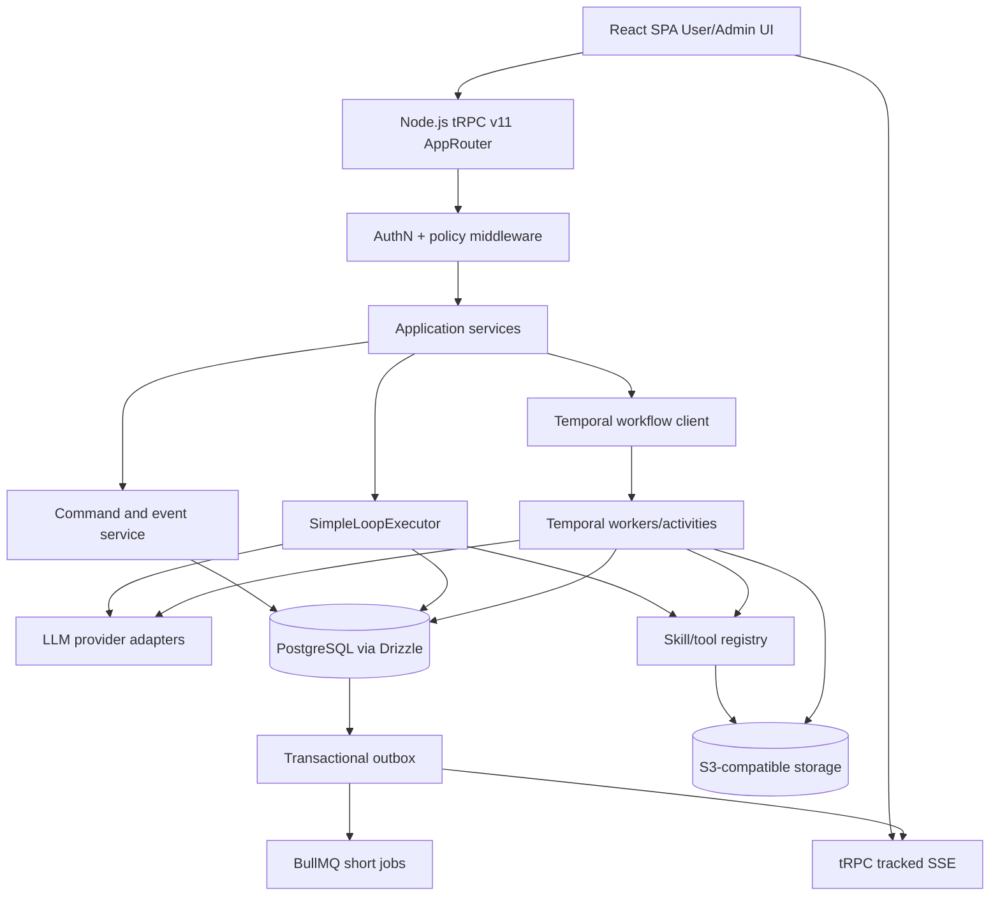

<!-- markdownlint-disable MD013 -->

# Agentic Chat Full Development Blueprint

> **Purpose:** define the full production agentic-chat platform after architecture validation. **tRPC and Drizzle are mandatory.**

The architecture-validation scope, fixed actors, fixture skills/tools, Docker Compose topology, and F01-F10 decision gate are defined separately in the [Agentic Chat MVP Development Blueprint](agentic-chat-mvp-development-blueprint.md). Complete that gate before starting the roadmap in this document.

## 1. Executive development decision

Extend the shared runtime contracts selected by the MVP into a production platform with complete identity, tenancy, product-facing conversation features, durable workflow operations, files and retrieval, memory, collaboration, governance, observability, security, deployment, and SLO requirements.

The intended full-platform shape is:

```text
React SPA + Vite/Rolldown
  → tRPC queries, mutations, and tracked subscriptions
  → Node.js API and application services
  → SimpleLoopExecutor | StateWorkflowExecutor
  → Drizzle + PostgreSQL system of record
  → BullMQ for short jobs | Temporal for durable workflows
```

Recommended primary stack:

| Layer | Decision |
| --- | --- |
| Package manager | pnpm workspaces |
| Web | React SPA, TypeScript, Vite 8 |
| Build | Rolldown through Vite 8 |
| UI | Tailwind CSS |
| API | Node.js + **tRPC v11** with Zod validation |
| SQL | **Drizzle ORM** with reviewed SQL migrations |
| Database | PostgreSQL |
| Simple Loop | Application-owned executor using provider adapters and shared tool registry |
| State Workflow | Temporal TypeScript |
| Short jobs | Redis + BullMQ |
| Streaming | tRPC SSE subscriptions with tracked event IDs as the sole client transport |
| LLM layer | Direct OpenAI Responses and Anthropic Messages adapters; optional Vercel AI SDK adapter |
| Files/artifacts | S3-compatible object storage |
| Auth | OIDC provider; product choice between managed or self-hosted remains open |
| Observability | OpenTelemetry plus an error/APM backend |
| Deployment | Static SPA, Node.js API, and long-running workers deployed separately |
| Quality | Biome for linting and formatting |
| CI/CD | GitHub Actions, reviewed migrations, immutable artifacts, canary rollout |

PostgreSQL is authoritative for product-facing state, permissions, audit records, and projections. Temporal history is authoritative for active State Workflow orchestration. Redis, object storage, and provider APIs are never authorities for product state. Reconciliation must repair PostgreSQL projections from Temporal history without treating either store as a duplicate workflow ledger.

## 2. Product actors

| Actor | Main responsibilities |
| --- | --- |
| User | Chat, files, search, approvals, cancellation, history, sharing, feedback, memory controls. |
| Admin | Hidden AI instructions, policy/tool configuration, run control, tenant governance, emergency controls. |
| Operator | Approval queue, escalation, run recovery, failed-step retry, incident handling. |
| Developer | Skills, tools, workflows, provider adapters, policies, tests, releases. |
| Auditor | Execution timeline, approvals, data access, model/tool versions, exports, legal holds. |
| Integration | Start runs, deliver webhooks, consume events, retrieve artifacts, expose MCP tools. |

## 3. Comprehensive use-case catalog

Priorities:

- **P0:** production launch baseline
- **P1:** production expansion
- **P2:** advanced platform

### 3.1 User chat and conversation

| Use case | Priority | Execution path |
| --- | ---: | --- |
| Stream a normal answer | P0 | Simple Loop |
| Continue saved conversation | P0 | Simple Loop or State Workflow |
| Stop generation | P0 | Both |
| Retry failed response | P0 | Both |
| Edit and resend message | P0 | New branch/run |
| Regenerate an answer | P0 | New run |
| Clarifying question | P0 | Both |
| Attach and analyze files | P0 | Upload plus workflow processing |
| Search attached files | P0 | Simple Loop tool |
| Web or knowledge search | P1 | Both |
| Visible citations | P0 | Structured message parts |
| Tool activity summary | P0 | Structured event projection |
| Long-running background task | P1 | State Workflow |
| Progress timeline | P1 | State Workflow events |
| Leave and return | P1 | Durable run and event cursor |
| Branch/fork conversation | P1 | Conversation branch |
| Share/revoke conversation | P1 | Permissioned share objects |
| Export transcript/artifacts | P1 | Async export workflow |
| Submit feedback/report safety | P0 | tRPC feedback procedures |
| Manage remembered facts | P1 | Memory CRUD and policy |

### 3.2 Skills and tools

| Use case | Priority | Required behavior |
| --- | ---: | --- |
| Register versioned tool | P0 | Schema, owner, risk, timeout, retry, approval policy. |
| Select relevant tools | P0 | Tenant/user/skill/policy filtering. |
| Execute read-only sync tool | P0 | Bounded timeout and structured result. |
| Execute side-effect tool | P0 | Idempotency, authorization, and risk-policy-required approval. |
| Start async tool | P1 | Durable acceptance, job ID, progress, cancellation. |
| Dry-run a tool | P1 | Preview without side effect. |
| Disable/rollback tool | P0 | New calls blocked; active calls remain inspectable. |
| Connect MCP server | P1 | Discovery, policy filter, schema normalization, audit. |
| Sandbox code/browser/file tool | P1 | Network, filesystem, credential, and resource restrictions. |
| Tool health/status | P1 | Availability, version, latency, error rate. |

### 3.3 HITL and hidden Admin controls

| Use case | Priority | Required behavior |
| --- | ---: | --- |
| Approve exact action | P0 | Bind approval to the tool-call ID, normalized-argument hash, tool and policy versions, approver scope, and expiry. |
| Reject with reason | P0 | Same run resumes with rejection result. |
| Edit before approval | P1 | New argument hash and fresh authorization. |
| Approval expiry | P1 | Explicit timeout policy. |
| Delegated approval | P1 | Route to an authorized alternate approver. |
| Multi-party or quorum approval | P2 | Require multiple independent decisions. |
| Hidden Admin instruction | P0 | Server-validated, signed Admin command or instruction. Enforce authorization and policy outside the model, audit its application, project only approved instruction content into model context, and exclude it from User-visible transcript projections. |
| Pause/resume/cancel run | P0 | Idempotent command and audit record. |
| Disable side effects globally | P0 | Emergency kill switch. |
| Retry/reconcile failed step | P1 | No repetition of completed effects. |
| Quarantine tenant/run | P0 | Block new execution and preserve evidence. |

### 3.4 Files, retrieval, memory, and collaboration

| Use case | Priority | Implementation boundary |
| --- | ---: | --- |
| Direct upload | P0 | Presigned object-storage upload. |
| Scan/parse/index file | P0 | State Workflow. |
| Permission-aware retrieval | P0 | Authorization before retrieval/model exposure. |
| File/page citations | P0 | Citation message parts. |
| Tenant knowledge base | P1 | ACL-aware indexing. |
| Conversation summary | P1 | Autocompaction state. |
| User/project memory | P1 | Scoped, reviewable, expiring records. |
| Memory deletion and opt-out | P1 | Launch gate: ship deletion and opt-out before enabling any persisted memory. |
| Memory CRUD and policy management | P1 | Review, edit, scope, expire, and govern memories. |
| Conversation sharing | P1 | Viewer/editor/approver roles and expiry. |
| Collaborative continuation | P2 | WebSocket/presence only when required. |

### 3.5 Recovery and operations

| Use case | Priority | Required behavior |
| --- | ---: | --- |
| Reconnect stream | P0 | Resume after tracked event ID. |
| Recover worker crash | P0 | Lease/checkpoint recovery. |
| Duplicate command/event | P0 | Unique idempotency and inbox keys. |
| Unknown side effect | P0 | Provider reconciliation before retry. |
| Cancel non-cooperative work | P1 | Requested/effective/irreversible states. |
| Resume after deployment | P1 | Version compatibility or quarantine. |
| Inspect stuck run | P0 | Admin/operator timeline. |
| Replay execution history | P1 | Audit/recovery function, not silent re-execution. |

## 4. High-level architecture



### Shared runtime contract

Both execution paths conform to the same application-facing:

- command schemas;
- run/event schemas;
- provider interface;
- skill/tool registry;
- authorization policy;
- approval envelope;
- message-part model;
- tool-operation ledger;
- compaction contract;
- audit and telemetry conventions.

Simple Loop code consumes provider and tool interfaces directly. State Workflow definitions invoke Activities that consume those interfaces. The paths differ in orchestration, scheduling, durability, recovery, determinism, and versioning requirements.

## 5. Repository structure

```text
apps/
  web/                       React SPA built by Vite/Rolldown
  api/                       Node.js tRPC server and webhooks
  worker/                    Simple Loop and BullMQ workers
  temporal-worker/           Temporal workflows and activities

packages/
  api/                       tRPC AppRouter and procedure middleware
  contracts/                 Zod commands, events, states, errors
  db/                        Drizzle schema, migrations, repositories
  domain/                    Entities, transitions, policies
  agent-runtime/             Executor interface and shared context builder
  simple-loop/               Simple Loop implementation
  workflows/                 Temporal workflow definitions
  providers/                 OpenAI/Anthropic/optional AI SDK adapters
  tools/                     Tool registry, policies, executors
  skills/                    Versioned skill definitions
  auth/                      Identity and authorization helpers
  observability/             OpenTelemetry setup and schemas
  testkit/                   Fakes, fixtures, failure injection

infra/
  docker/
  temporal/
  deployment/
  monitoring/
```

Keep tRPC resolvers thin: authenticate, validate, call an application service, and return a typed result. Do not run model loops or tools directly inside procedure implementations.

## 6. Frontend development

### 6.1 Routes

```text
apps/web/src/
  routes/
    chats.tsx
    chat-detail.tsx
    admin/
      runs.tsx
      approvals.tsx
      tools.tsx
      skills.tsx
      policies.tsx
      audit.tsx
  api/
    trpc-client.ts
```

The Node API exposes tRPC and signed provider webhook endpoints separately from the SPA bundle.

### 6.2 Component inventory

```text
ChatShell
ConversationList
MessageScroller
UserMessage
AssistantMessage
MessagePartRenderer
ToolInvocationCard
ApprovalCard
JobProgressCard
WorkflowTimeline
CitationList
AttachmentCard
CompactionMarker
RecoveryBanner
ConnectionStatus
Composer
StopButton

AdminRunInspector
AdminCommandComposer
ApprovalQueue
ToolPolicyEditor
AuditTimeline
EmergencyControls
```

Use route-level code splitting for the React SPA. Fetch the authenticated initial snapshot through tRPC, then use narrow client subscriptions for live updates, interactive approvals, scroll behavior, and connection recovery.

### 6.3 Client data flows

| Surface | Query | Live updates | Mutation |
| --- | --- | --- | --- |
| Conversation | `conversations.get` | `runs.events` | `chat.sendMessage` |
| Run | `runs.get` | `runs.events` | cancel/retry/resume |
| Approval | `approvals.get` | `approvals.subscribe` | approve/reject/edit |
| Job | `jobs.get` | `jobs.subscribe` | cancel/retry |
| Admin | admin queries | `admin.events` | authorized Admin commands |

Use optimistic UI only for the User's submitted message and local presentation state. Tool approval, Admin mutation, deletion, cancellation, and policy changes remain pessimistic.

### 6.4 Streaming

- Use tRPC tracked SSE subscriptions as the sole live transport for run events, including message deltas and structured parts.
- Persist each event before publication.
- Resume from `lastEventId` and deduplicate by event ID.
- AI SDK types or rendering helpers may be used internally, but the AI SDK UI stream is not a second client transport.
- Refetch canonical run state when cursor retention expires.
- A client disconnect does not cancel the run.

SSE heartbeats are ephemeral transport frames. They are not persisted domain events and do not consume aggregate sequence numbers.

tRPC supports SSE and WebSocket subscriptions, and tracked events support reconnection from the last received ID [tRPC Subscriptions][trpc-subscriptions].

### 6.5 Accessibility

- Use a labeled `role="log"` for chat updates.
- Announce milestones, not every token.
- Preserve composer focus after send.
- Move focus to approval dialogs only when action is required.
- Provide keyboard-operable native controls and visible focus.
- Use textual progress and actionable errors.
- Respect reduced motion and mobile target sizes.

## 7. tRPC application contract

### 7.1 Procedure middleware

```text
publicProcedure
authedProcedure
tenantProcedure
conversationProcedure
runParticipantProcedure
operatorProcedure
adminProcedure
auditorProcedure
integrationProcedure
```

Every exposed tRPC procedure has Zod input and output validation. Authorization uses server-side middleware plus resource-level checks [tRPC Authorization][trpc-auth].

### 7.2 Router catalog

```text
conversations.list/get/create/rename/archive/delete/fork/export
chat.sendMessage/retryMessage/regenerateResponse/editMessage/cancelGeneration
runs.get/list/cancel/retry/resume/replay/events
workflows.listInstances/getInstance/pause/resume/cancel/retryStep/submitExternalEvent
approvals.listPending/get/approve/reject/requestChanges/expire/subscribe
jobs.get/list/cancel/retry/subscribe
files.createUpload/completeUpload/get/list/delete/retryProcessing/processingEvents
search.web/knowledgeBase/conversation/file
memory.list/get/create/update/delete/setPolicy/export
sharing.createLink/revokeLink/addMember/removeMember/updatePermission
feedback.submit/update/reportSafetyIssue
admin.runs.inspect/pause/resume/cancel/retryStep
admin.tools.enable/disable/rotateVersion
admin.policies.get/update
admin.audit.query/export
operator.queue/list/takeOver/escalate/resolve
integrations.register/disable/rotateCredential/webhookReplay
```

Inbound provider webhooks use signed raw HTTP routes. The route validates the provider payload and invokes the same application service used by tRPC procedures; it does not bypass command, inbox, authorization, or audit contracts.

### 7.3 Command envelope

```text
commandId
tenantId derived from authenticated context
aggregateType
aggregateId
conversationId?
runId?
clientInstanceId?
clientSequence?
idempotencyKey
expectedVersion?
commandType
payload
createdAt
```

Duplicate commands return the original result. Stale versions return a typed conflict. Command acceptance, initial domain event, and outbox row commit in one Drizzle transaction.

### 7.4 Event envelope

```text
eventId
tenantId
aggregateType
aggregateId
conversationId?
runId?
sequence
type
version
visibility
payload
traceId
correlationId
causationId
createdAt
```

Each command or event schema defines which contextual IDs are required for its aggregate type.

Client-originated commands require both client sequencing fields; server-originated commands omit both.

Core events:

```text
run.accepted / started / status_changed / completed / failed / cancelled
message.started / delta / completed
tool.call.started / approval_required / completed / failed
workflow.step.started / completed / waiting
job.accepted / progress / completed / failed
compaction.started / completed / failed
admin.command.accepted / applied / rejected
```

## 8. Drizzle and PostgreSQL data model

Organize schemas by domain:

```text
packages/db/src/schema/
  tenancy.ts
  conversations.ts
  messages.ts
  executions.ts
  tools.ts
  approvals.ts
  files.ts
  memory.ts
  events.ts
  audit.ts
  objects.ts
```

### Core tables

```text
tenants, users, memberships, roles, permissions, service_accounts
conversations, conversation_members, conversation_branches
messages, message_parts, message_revisions, citations, attachments
commands, command_results, runs, run_steps, run_attempts, domain_events
tools, tool_versions, tool_bindings, tool_policies, tool_calls, tool_results
approval_requests, approval_actions, policy_decisions
jobs, job_attempts, job_events, workflow_handles
files, file_versions, file_permissions, file_processing_jobs
knowledge_bases, knowledge_base_files, search_queries, search_results
memory_items, memory_sources, memory_permissions
admin_commands, audit_events, retention_policies, legal_holds
outbox_events, inbox_events, idempotency_keys
objects, object_versions
```

### Required constraints and indexes

```text
UNIQUE commands(tenant_id, idempotency_key)
UNIQUE commands(tenant_id, client_instance_id, client_sequence)
  WHERE client_instance_id IS NOT NULL AND client_sequence IS NOT NULL
UNIQUE domain_events(tenant_id, aggregate_type, aggregate_id, sequence_number)
UNIQUE tool_calls(tenant_id, idempotency_key)
UNIQUE inbox_events(consumer_name, external_event_id)

INDEX messages(tenant_id, conversation_id, created_at, id)
INDEX runs(tenant_id, status, updated_at)
INDEX approval_requests(tenant_id, status, created_at)
INDEX outbox_events(next_attempt_at, created_at) WHERE published_at IS NULL
INDEX audit_events(tenant_id, occurred_at DESC)
```

Drizzle supports typed schema declarations, constraints, indexes, transactions, migration generation, and PostgreSQL RLS [Drizzle Overview][drizzle-overview] [Drizzle Constraints][drizzle-constraints] [Drizzle Transactions][drizzle-transactions].

### Transaction boundaries

**Send message:** validate access, insert message, create run, append event, insert idempotency and outbox rows, commit, then start executor.

**Resolve approval:** lock request, validate state/expiry/hash, record decision, update call/run, append event/outbox, commit, then resume.

**Cancel run:** lock run, mark cancellation requested, append event/outbox, commit, then signal worker.

Never hold a database transaction open during an LLM call, network tool, human wait, or file-processing job.

### Migration policy

```text
Drizzle TypeScript schema
  → drizzle-kit generate
  → review migration SQL
  → migration tests
  → drizzle-kit migrate
```

Use custom reviewed SQL for concurrent indexes, RLS, partitions, triggers, extensions, and data backfills. Use expand/contract migrations for destructive changes. Do not perform runtime schema mutation in web or worker processes.

## 9. Execution architecture

### 9.1 Shared executor interface

```text
ExecutionCoordinator.start(command) -> run receipt
ExecutionCoordinator.resume(event) -> accepted result
ExecutionCoordinator.cancel(command) -> cancellation state
ExecutionCoordinator.inspect(runId) -> canonical snapshot
```

### 9.2 Simple Loop

Use for direct chat and bounded tool work:

```text
admit command
→ acquire run lease/fencing token
→ rebuild context
→ autocompact if needed
→ call provider
→ persist complete provider event
→ authorize/execute tool or finalize
→ continue until terminal limit
```

Hard limits: turns, wall-clock duration, tokens, cost, tool calls, output size, and retries.

### 9.3 State Workflow

Use Temporal when a path needs durable waits, retries, timers, signals, approvals, multiple stages, or infrastructure-loss recovery.

Workflow code contains deterministic orchestration. LLM, database, tool, object-storage, and external network operations run in Activities [Temporal TypeScript][temporal-ts]. Project product-facing state into Drizzle tables; do not duplicate Temporal's full history.

### 9.4 BullMQ boundary

Use BullMQ for independent, short-lived execution scheduling:

- bounded file scanning, extraction, or embedding tasks that are not part of a multi-stage durable workflow;
- notifications;
- outbox relay;
- webhook delivery;
- bounded background tools.

Multi-stage scan, parse, index, retry, and progress coordination belongs to Temporal, whose Activities may perform those tasks directly. Do not nest BullMQ jobs inside a Temporal workflow unless an ADR defines result delivery, cancellation, idempotency, and recovery.

BullMQ is not the State Workflow engine. PostgreSQL remains authoritative for job/product projections, and jobs are idempotent because delivery can repeat [BullMQ Production][bullmq-production].

## 10. Providers, tools, and skills

### Provider adapter

```text
generate(request, signal: AbortSignal) -> AsyncIterable<ProviderEvent>
```

Implement direct adapters for OpenAI Responses and Anthropic Messages. Normalize text deltas, tool-call arguments, usage, completion, failure, cancellation, and provider continuation IDs.

Vercel AI SDK may be an optional adapter for provider portability and internal message-part conversion; it does not provide a second client transport or replace application contracts or Temporal durability [AI SDK Core][ai-sdk].

### Tool definition

```text
toolId / version / namespace / owner
description
inputSchema / outputSchema
riskLevel
capabilities
executionClass: sync | async | workflow
approvalPolicy
timeout / retryPolicy
idempotencyPolicy
tenantVisibility
credentialReference
```

Validate tool definitions and schemas before including them in a provider request. Validate model-generated tool arguments against the registered schema before authorization and again at the execution boundary. Treat MCP tool annotations as untrusted until the server is authorized [MCP Tools][mcp-tools].

### Skill definition

```text
skillId / version / owner
instructions
input/output schemas
allowed tools
required capabilities
side-effect level
approval policy
runtime preference
timeout/retry/compensation policy
evaluation dataset version
```

## 11. Autocompaction and memory

Compaction is an explicit state transition with a committed source boundary:

```text
model_context = committed_compaction
              + events_after_boundary
              + newly_admitted_input
```

Preserve active calls, approvals, jobs, hidden Admin state, policy, continuation IDs, and audit linkage outside the lossy summary. Failed compaction leaves the previous context active.

Memory is separate from transcript and workflow state. Every memory item has scope, provenance, confidence, owner, permissions, expiry, and deletion state.

## 12. Security and governance

### P0 controls

- OIDC/OAuth hardening and privileged step-up authentication;
- tenant scoping in tRPC context and every Drizzle query;
- PostgreSQL RLS as defense in depth;
- deterministic authorization outside the LLM;
- tool allowlists, least privilege, and side-effect approval;
- prompt-injection boundaries for files, web, retrieval, memory, and tools;
- output encoding and schema validation;
- SSRF protection and sandboxed file processing;
- secrets through workload identity/secret manager, never prompts;
- per-tenant token, cost, duration, file, and concurrency budgets;
- Admin command signing, expiry, nonce, context binding, and audit;
- append-only/tamper-resistant audit evidence;
- provider data-handling and regional allowlists;
- emergency tool/provider/model kill switches.

Security baselines: OWASP LLM/Agent guidance, ASVS, NIST AI RMF, NIST 800-53, SSDF, OAuth Security BCP, and OIDC [OWASP Agent Security][owasp-agent] [NIST AI RMF][nist-ai] [OAuth BCP][oauth-bcp].

### Tenant isolation tests

Test cross-tenant access through conversations, search, citations, files, memory, run IDs, jobs, logs, exports, approvals, Admin commands, and provider requests.

## 13. Observability, evaluation, and SLOs

### Trace hierarchy

```text
chat.request
  agent.run
    llm.request
    retrieval.query
    tool.call
    workflow.task
  chat.response
```

Propagate OpenTelemetry context through tRPC, BullMQ, Temporal, provider, and tool boundaries. Record stable metadata; keep raw prompts, secrets, and customer content out of unrestricted telemetry [OpenTelemetry Traces][otel-traces].

### Metrics

- availability and task success;
- time to first token and completion p50/p95/p99;
- streaming duplication/truncation;
- queue depth/age and workflow-task latency;
- recovery success and latency;
- duplicate side effects and unknown outcomes;
- provider/tool errors, retries, and rate limits;
- token usage and cost per successful task;
- trace completeness;
- eval score by runtime/model/release/tenant cohort.

### Evaluation datasets

Maintain versioned happy-path, multi-turn, tool, recovery, safety, retrieval, adversarial, and production-regression datasets. Use deterministic graders where possible and calibrate LLM judges against human labels [OpenAI Eval Guidance][openai-evals].

### Initial SLO candidates

These require local measurement and stakeholder approval:

```text
availability                     ≥ 99.9%
retryable recovery success       ≥ 99.9%
stream integrity                 ≥ 99.99%
correlated root traces           ≥ 99%
duplicate irreversible effects   0 tolerated
silent lost work                 0 tolerated
```

## 14. Testing strategy

Architecture-validation testing is defined in the [Agentic Chat MVP Development Blueprint](agentic-chat-mvp-development-blueprint.md) and its [MVP Validation Test Plan](agentic-chat-mvp-validation-test-plan.md). The layers below apply to the full platform after that gate.

### Test pyramid

| Layer | Scope |
| --- | --- |
| Unit | Parsers, reducers, transitions, policies, retries, redaction. |
| Contract | Zod/tRPC procedures, event unions, provider/tool interfaces. |
| Database | Drizzle constraints, transactions, RLS, migrations, outbox/inbox. |
| Component | Executors, registry, context builder, compactor. |
| Workflow | Temporal time-skipping, mocked Activities, signals, history replay. |
| Integration | PostgreSQL, Redis, workers, provider/tool fakes. |
| E2E | User/Admin flows through both runtimes. |
| Eval | Quality, safety, retrieval, trajectory, cost. |
| Performance | Load, soak, burst, concurrency, queue saturation. |
| Recovery | Crash, duplicate delivery, outage, migration, replay. |

### Mandatory failure tests

- process kill before/after every durable boundary;
- external effect succeeds before local acknowledgement;
- duplicate tRPC mutation and tracked event;
- stale approval and Admin command replay;
- browser disconnect during stream;
- BullMQ stalled job/redelivery;
- Temporal worker restart and Activity retry;
- database failover/pool exhaustion;
- provider timeout/rate limit/malformed stream;
- compaction failure before/after commit;
- workflow version change with open runs;
- tenant access revoked after job enqueue;
- cancellation during non-cooperative tool;
- audit/telemetry backend outage.

## 15. Deployment and operations

Recommended split:

```text
Web:               Vite/Rolldown React SPA on static hosting/CDN
API:               Node.js tRPC service
Simple workers:    Node worker service
Temporal workers:  separate Node worker service
Database:          managed PostgreSQL
Redis/BullMQ:      managed Redis with persistence/no-eviction
Workflow:          Temporal Cloud initially
Objects:           S3-compatible managed storage
Telemetry:         OpenTelemetry Collector + backend
```

Deployment options:

- static SPA hosting + Cloud Run API/workers + Temporal Cloud for fastest delivery;
- Cloud Run for API and workers with the SPA on managed static hosting;
- ECS/Fargate for AWS-standard enterprise operations;
- Kubernetes only with an existing platform team.

CI gates:

1. typecheck, lint, dependency/security scans;
2. unit, contract, database, and integration tests;
3. Drizzle migration generation/review/test;
4. Temporal history replay compatibility;
5. eval regression and cost/latency budgets;
6. E2E smoke and recovery tests;
7. immutable artifact build and attestation;
8. staging deployment;
9. canary/control comparison;
10. automatic pause/rollback on SLO or eval regression.

## 16. Phased development roadmap

Start this roadmap only after the [MVP decision gate](agentic-chat-mvp-development-blueprint.md#12-mvp-definition-of-done).

### Full-0: production foundations

- pnpm workspace and strict TypeScript;
- React SPA with Vite/Rolldown and Tailwind CSS;
- Node.js tRPC services and Biome quality gates;
- complete Drizzle schema and migration workflow;
- identity, tenancy, authorization, RLS;
- command, run, event, outbox, audit, and telemetry contracts;
- OpenTelemetry and structured error taxonomy;
- provider adapters and production secrets/configuration boundaries.

### Full-1: Simple Loop vertical slice

- streaming chat and conversation persistence;
- structured message parts and reconnectable run events;
- direct provider adapter;
- tool registry and read-only tools;
- approval-gated side-effect tool;
- cancellation, retries, limits, and autocompaction;
- Admin run inspection and tool disable;
- recovery and tenant-isolation tests.

### Full-2: durable workflow completion

- Temporal infrastructure and worker;
- shared executor adapter;
- durable approvals, waits, signals, retries, and versioning;
- async tools and progress timelines;
- file-processing workflow, file analysis, and citations;
- feedback and safety reporting;
- workflow replay tests, operator queue, and recovery controls.

### Full-3: production expansion

- tenant knowledge search and knowledge-base citations;
- sharing, branching, feedback triage, analytics, governance workflows, and memory controls;
- MCP integrations;
- advanced Admin/audit/governance;
- SLO dashboards, evaluation pipeline, chaos campaigns;
- canary and rollback automation.

### Full-4: advanced capabilities

- multi-agent delegation;
- parallel workflows and compensation;
- collaborative/multi-channel experiences;
- policy-as-code and anomaly detection;
- provider fallback based on evaluated policy.

## 17. Definition of done per capability

Every capability must specify:

```text
Actor and preconditions
tRPC procedure and Zod input/output
Authorization middleware and resource check
Drizzle tables, constraints, and transaction
State transition and events
Simple Loop / State Workflow / both
Idempotency and concurrency behavior
Failure, cancellation, and recovery behavior
Audit and telemetry
Security tests
Functional/E2E/eval acceptance tests
Priority and rollout plan
```

## 18. Open ADRs before coding

1. OIDC provider: managed versus self-hosted.
2. Temporal Cloud region, retention, and cost.
3. Exact event retention and cursor-expiry policy.
4. Outbox target: BullMQ only or additional durable event broker.
5. Object-storage region, encryption, legal hold, and retention.
6. Search/vector technology and ACL model.
7. Admin approval roles, quorum, expiry, and notification channels.
8. Multi-tenancy isolation tier and regulated-data requirements.
9. Product SLOs, traffic profile, provider budgets, and failure tolerance.

## 19. Primary research sources

### Mandatory stack

- [tRPC Overview][trpc]
- [tRPC Authorization][trpc-auth]
- [tRPC Subscriptions][trpc-subscriptions]
- [Drizzle Overview][drizzle-overview]
- [Drizzle Constraints and Indexes][drizzle-constraints]
- [Drizzle Transactions][drizzle-transactions]
- [Drizzle Migrations][drizzle-migrations]

### Product and runtime

- [OpenAI Agents][openai-agents]
- [OpenAI Conversation State][openai-state]
- [Anthropic Tool Use][anthropic-tools]
- [AI SDK Core][ai-sdk]
- [Temporal TypeScript][temporal-ts]
- [BullMQ Production][bullmq-production]
- [MCP Tools][mcp-tools]

### Frontend and quality

- [Vite Production Build][vite-build]
- [OpenTelemetry Traces][otel-traces]
- [OpenAI Evaluation Best Practices][openai-evals]
- [Google SRE Monitoring][sre-monitoring]

### Security

- [OWASP AI Agent Security][owasp-agent]
- [NIST AI RMF][nist-ai]
- [OAuth 2.0 Security BCP][oauth-bcp]

[trpc]: https://trpc.io/docs/
[trpc-auth]: https://trpc.io/docs/server/authorization
[trpc-subscriptions]: https://trpc.io/docs/server/subscriptions
[drizzle-overview]: https://orm.drizzle.team/docs/overview
[drizzle-constraints]: https://orm.drizzle.team/docs/indexes-constraints
[drizzle-transactions]: https://orm.drizzle.team/docs/transactions
[drizzle-migrations]: https://orm.drizzle.team/docs/migrations
[openai-agents]: https://developers.openai.com/api/docs/guides/agents
[openai-state]: https://developers.openai.com/api/docs/guides/conversation-state
[anthropic-tools]: https://platform.claude.com/docs/en/agents-and-tools/tool-use/how-tool-use-works
[ai-sdk]: https://ai-sdk.dev/docs/ai-sdk-core/overview
[temporal-ts]: https://docs.temporal.io/develop/typescript/core-application
[bullmq-production]: https://docs.bullmq.io/guide/going-to-production
[mcp-tools]: https://modelcontextprotocol.io/specification/2026-07-28/server/tools
[vite-build]: https://vite.dev/guide/build
[otel-traces]: https://opentelemetry.io/docs/concepts/signals/traces/
[openai-evals]: https://developers.openai.com/api/docs/guides/evaluation-best-practices
[sre-monitoring]: https://sre.google/sre-book/monitoring-distributed-systems/
[owasp-agent]: https://cheatsheetseries.owasp.org/cheatsheets/AI_Agent_Security_Cheat_Sheet.html
[nist-ai]: https://www.nist.gov/itl/ai-risk-management-framework
[oauth-bcp]: https://www.rfc-editor.org/rfc/rfc9700
