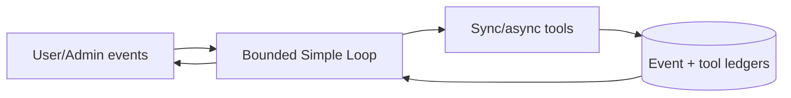
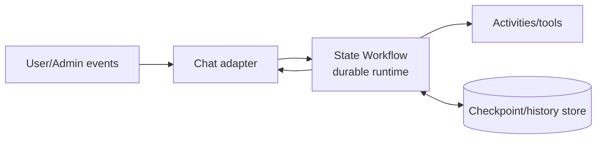
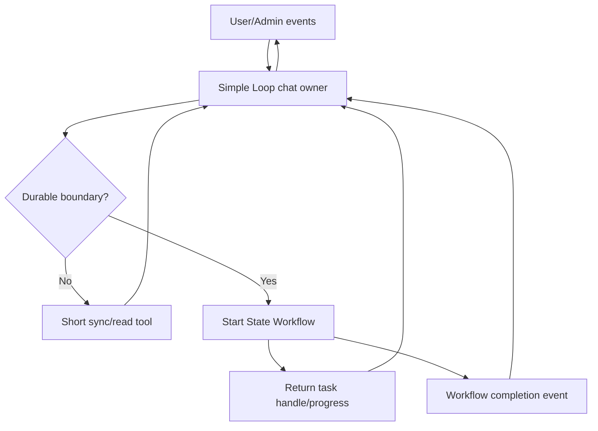

<!-- markdownlint-disable MD013 -->

# Agentic Chat Method Comparison

> **Decision:** choose between Simple Loop, State Workflow, or a Hybrid architecture for chat with User, AI, hidden Admin commands, HITL approvals, skills, sync/async tools, autocompaction, and recovery.

## 1. Research conclusion

The methods differ primarily in **runtime guarantees**, not model intelligence.

- **Simple Loop** is the better default for short, real-time, adaptive chat.
- **State Workflow on a durable runtime** is better for durable stages, long waits, approvals, explicit transitions, and infrastructure-level recovery.
- **Hybrid** is strongest when most turns are short and only a minority cross a durable boundary.

Anthropic and OpenAI describe starting with bounded agent loops, while Vercel, Cloudflare, Google, and Microsoft document workflow options for structured or durable execution [Anthropic Effective Agents][anthropic-effective] [OpenAI Orchestration][openai-orchestration] [Vercel Workflow Agent][vercel-workflow] [Cloudflare Workflows][cloudflare-workflows] [Google ADK Workflows][adk-workflows] [Microsoft Agent Framework Workflows][ms-workflows].

## 2. Side-by-side comparison

| Dimension | Simple Loop | State Workflow |
| --- | --- | --- |
| Control | Model chooses the next tool/step. | Graph/state machine validates legal transitions. |
| Best task shape | Open-ended, adaptive, short. | Explicit stages, branches, waits, joins. |
| Initial complexity | Low. | Medium to high. |
| Request latency | Usually lower. | Usually higher because of additional orchestration boundaries. |
| Streaming chat UX | Natural. | Requires a User-facing adapter. |
| Recovery | Application-owned event log, tool ledger, leases, reconcilers. | Checkpoint/state recovery; runtime replay when backed by a durable engine. |
| Worker-loss handling | Must be built. | Runtime-dependent; strong in durable engines. |
| Tool side effects | Application idempotency required. | Still requires application idempotency. |
| Async jobs | Queue/job service plus resume dispatcher. | Native waiting states/events in many runtimes. |
| HITL | Paused run record around loop. | First-class interrupt/request/signal state. |
| Hidden Admin command | Model-only event queued for next AI boundary. | Typed control event routed through graph. |
| Autocompaction | Middleware/checkpoint boundary around context. | Explicit resumable node/state. |
| Parallelism | Model/tool-runner managed; fan-in is manual. | Explicit branches, joins, reducers/barriers. |
| Auditability | Trace reconstruction from events. | State/transition history is structural. |
| Version migration | Run-envelope compatibility. | Workflow/state/runtime version compatibility. |
| Storage | Events, operations, outbox/inbox, compaction snapshots. | Checkpoints/history, tasks, events, runtime metadata. |
| Vendor coupling | Lower with application-owned contracts. | Higher around runtime history/checkpoint semantics. |
| Testing | Loop, crash-window, and ledger tests. | Transition, node, replay, migration, and runtime tests. |

## 3. Architecture choices

### Option A: Simple Loop only

Choose only if the team is willing to own recovery infrastructure and most operations remain short.

### Option B: State Workflow on a durable runtime only

Choose when nearly every meaningful interaction is a durable business process and added orchestration latency is acceptable.

### Option C: Hybrid

Recommended durable-boundary triggers:

- expected duration exceeds the request lifecycle;
- Admin/User response may arrive later;
- process loss must not lose progress;
- more than one independently retryable stage exists;
- consequential external effects need explicit approval/reconciliation;
- parallel branches require an inspectable join;
- operators need current-state and history queries.

## 4. Decision scorecard

The following weights are illustrative. Calibrate them with stakeholders, then score each requirement's criticality from 0 (not needed) to 3 (critical).

| Requirement | Simple Loop weight | State Workflow weight |
| --- | ---: | ---: |
| Lowest chat latency | 3 | 1 |
| Adaptive open-ended routing | 3 | 2 |
| Minimal initial engineering | 3 | 1 |
| Process/worker restart recovery | 1 | 3 |
| Long waits and external events | 1 | 3 |
| Complex HITL | 1 | 3 |
| Explicit legal transitions | 1 | 3 |
| Parallel fan-out/fan-in | 1 | 3 |
| Workflow audit/history queries | 1 | 3 |
| Low vendor/runtime coupling | 3 | 1 |
| Versioned in-flight migration | 1 | 3 |
| Existing Simple Loop expertise | 3 | 1 |
| Existing workflow-runtime expertise | 1 | 3 |

Multiply each requirement's criticality by its method weight. Treat integrity/recovery requirements as hard gates rather than allowing latency points to outweigh them.

## 5. Hard decision rules

### Keep a path in Simple Loop when all are true

- p95 task duration fits the interactive request target;
- work is reconstructable or cheap to redo;
- side effects are read-only, idempotent, or externally queryable;
- approval is rare and short;
- explicit stages and joins are not product requirements;
- the team can operate event/tool ledgers and reconciliation.

### Move a path to State Workflow when any hard gate is true

- no silent lost work is allowed across process restarts;
- runs regularly wait for approvals, User responses, timers, or callbacks;
- a task has several durable stages with independent retries;
- current state must be queried or audited directly;
- in-flight work must survive deployments;
- compensation, fan-out/fan-in, or formal transition rules are required.

### Select Hybrid when

- the product is conversational but some tools start durable work;
- most turns are fast, while a minority are long or consequential;
- chat must stay responsive during workflow execution;
- you want incremental migration rather than a full workflow rewrite.

## 6. Recovery comparison

| Failure | Simple Loop response | State Workflow response |
| --- | --- | --- |
| Crash before model call | Replay admitted event. | Resume from checkpoint/history. |
| Crash after model response | Reconcile provider response and local event. | Reconcile the provider response or retry the model activity/node according to its idempotency policy. |
| Crash after side effect | Tool ledger enters `unknown`; query/retry by idempotency key. | Activity may retry; still reconcile/idempotently execute. |
| Approval pending | Rehydrate paused run and approval ledger. | Restore interrupt/request/signal state. |
| Async event missed | Periodic job reconciliation finds terminal state. | A durable runtime replays a recorded signal/event; otherwise, a reconciler resumes the workflow. |
| Compaction interrupted | Keep previous boundary active. | Retry explicit compaction node from checkpoint. |
| Deployment changes schema | Validate run-envelope versions. | Route compatible workers or migrate/quarantine checkpoint. |
| Duplicate resume | Run-version compare-and-set. | Event/update ID plus workflow concurrency controls. |

Neither method eliminates the unknown-outcome window for arbitrary external effects. Both require idempotency keys, operation identities, deduplication, and reconciliation. Application-owned delivery designs may also require inbox/outbox patterns.

## 7. Benchmark before selection

Run the same model, prompts, tools, inputs, concurrency, retry budget, and failure schedule through both methods.

### Required scenario families

1. direct answer;
2. single sync tool;
3. multi-step tool chain;
4. hidden Admin command;
5. Admin approval/edit/reject/expiry;
6. async tool completion;
7. autocompaction;
8. tool timeout/rate limit/permanent error;
9. process kill at every durable boundary;
10. duplicate event and queue redelivery;
11. concurrent User/Admin events;
12. deployment/version change;
13. cancellation;
14. parallel work and partial failure;
15. dependency outage and backlog drain.

### Hard metrics

| Category | Metrics |
| --- | --- |
| Quality | task correctness, tool-selection correctness, conversation consistency |
| Integrity | duplicate irreversible effects, silent lost work, illegal transitions |
| Recovery | recovery success, recovery latency, retry amplification, resume compatibility |
| Performance | time to first token, p50/p95/p99 end-to-end latency, throughput |
| Cost | model/tool/runtime/storage cost per successful and recovered task |
| Operations | stuck/orphan runs, trace completeness, backlog drain, operator interventions |

Quality and integrity are hard gates. If both pass, use p95/p99 latency, cost per successful task, and operational simplicity as tie-breakers. OpenAI recommends evaluating traces as well as final results; Google SRE recommends correctness, availability, latency percentiles, throughput, saturation, and product-specific SLOs [OpenAI Trace Grading][openai-trace] [Google SRE SLOs][sre-slo].

## 8. Proposed starting gates

These are initial targets to replace with stakeholder-approved SLOs and measured baselines:

| Gate | Starting target |
| --- | ---: |
| Critical task correctness | ≥ 99% |
| No silent lost work | 0 tolerated |
| Duplicate irreversible side effects | 0 tolerated |
| Recovery success for retryable faults | ≥ 99% |
| Trace completeness | ≥ 99% |
| State-transition violations | 0 for critical paths |
| Unnecessary retries on permanent failures | ≤ 1% |
| Cancellation orphan rate | ≤ 0.5% |

Do not adopt these as universal standards. Measure actual User tasks, business impact, tool semantics, provider limits, and acceptable latency.

## 9. Recommendation for this product

Given the stated requirements:

- hidden Admin-to-LLM commands;
- Admin/HITL approval;
- sync and async tools;
- autocompaction;
- restart recovery;

Because restart recovery is explicit, **State Workflow on a durable workflow runtime** is the evidence-supported default if only the listed requirements are known. Choose **Hybrid** if measurements show that most turns are short and only a minority involve durable waits, independently retryable stages, or restart-critical work:

1. retain a bounded Simple Loop as the User-facing conversation owner;
2. keep direct answers and short read-only tools in the loop;
3. introduce a durable workflow boundary for long-running async tools, delayed approvals, multi-stage side effects, and tasks that must survive process loss;
4. use shared message, command, approval, tool-operation, event, and audit schemas across both runtimes;
5. return workflow handles and progress through the same chat stream;
6. evaluate whether additional paths need migration based on traces and failure tests.

If the organization requires exactly one method, choose **State Workflow on a durable workflow runtime** because restart recovery is explicit and this option provides stronger structural support for asynchronous work and approvals. Expect higher implementation and operational cost.

## 10. Primary references

1. [Anthropic Building Effective Agents][anthropic-effective]
2. [OpenAI Agent Orchestration][openai-orchestration]
3. [Vercel Workflow Agent][vercel-workflow]
4. [Cloudflare Agent Workflows][cloudflare-workflows]
5. [Google ADK Workflows][adk-workflows]
6. [Microsoft Agent Framework Workflows][ms-workflows]
7. [OpenAI Trace Grading][openai-trace]
8. [Google SRE SLOs][sre-slo]
9. [Temporal Pre-production Testing][temporal-testing]

[anthropic-effective]: https://www.anthropic.com/engineering/building-effective-agents
[openai-orchestration]: https://developers.openai.com/api/docs/guides/agents/orchestration
[vercel-workflow]: https://ai-sdk.dev/docs/agents/workflow-agent
[cloudflare-workflows]: https://developers.cloudflare.com/agents/runtime/execution/run-workflows/
[adk-workflows]: https://google.github.io/adk-docs/workflows/
[ms-workflows]: https://learn.microsoft.com/en-us/agent-framework/concepts/workflows/
[openai-trace]: https://platform.openai.com/docs/guides/trace-grading
[sre-slo]: https://sre.google/sre-book/service-level-objectives/
[temporal-testing]: https://docs.temporal.io/best-practices/pre-production-testing
