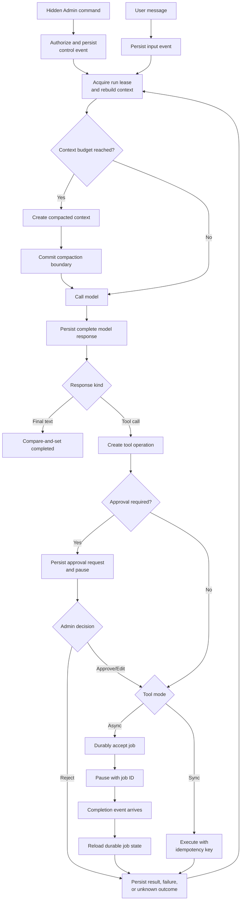

<!-- markdownlint-disable MD013 -->

# Simple Loop Architecture

> **Scope:** a production-oriented agent/tool loop for chat with User messages, hidden Admin-to-LLM instructions, Admin/HITL approvals, skills, synchronous tools, asynchronous tools, autocompaction, and restart recovery.

## 1. Executive assessment

A Simple Loop is a minimal general-purpose agent runtime:

```text
model → tool request → application executes tool → tool result → model
```

OpenAI and Anthropic document this as the canonical tool-calling exchange [OpenAI Function Calling][openai-tools] [Anthropic Tool Use][anthropic-tools]. It is best when the model must adaptively choose a small number of steps and the User expects an immediate conversational response.

The basic loop shown above provides no durable state on its own. Production recovery therefore requires an application-owned durable envelope around it. The recommended semantics are:

- append-only ordered events are the recovery source of truth;
- model-loop state and tool side effects are recovered separately;
- execution is at least once, while effects are made idempotent;
- ambiguous external outcomes become `unknown`, never assumed failed;
- approvals resume the same run and tool call;
- async events wake a dispatcher, which re-reads durable state;
- autocompaction creates a committed boundary but does not replace the event log.

## 2. When this method fits

Choose Simple Loop when most turns:

- finish in one request or a few model/tool iterations;
- need adaptive rather than predetermined routing;
- are latency-sensitive and conversational;
- use read-only or naturally idempotent tools;
- can tolerate application-managed recovery;
- do not require many explicit stages or parallel branches.

Do not use a pure Simple Loop as the sole runtime when long waits, complex approvals, multi-day execution, mandatory worker-loss recovery, or auditable stage transitions dominate the product.

## 3. Runtime flow



## 4. Durable data model

### 4.1 Run envelope

```text
agent_runs
├── run_id
├── conversation_id
├── status
├── run_version
├── lease_owner / lease_until / fencing_token
├── loop_step
├── model_provider / model_id
├── provider_continuation_id
├── agent_definition_version
├── admin_policy_version / hash
├── tool_schema_hash
├── current_compaction_id
├── last_committed_sequence
├── terminal_result_ref
├── created_at / updated_at
└── error_code
```

Recommended statuses:

```text
admitted
running_model
processing_response
waiting_for_admin
waiting_for_user
waiting_for_tool
recovering
completed
failed
cancelled
limit_reached
stale_version
```

Use optimistic concurrency on `run_version`. Every worker acquires a lease with a fencing token before mutating a run. A stale worker cannot finalize or overwrite a newer attempt.

### 4.2 Ordered event log

```text
run_events
├── event_id
├── run_id / conversation_id
├── sequence_number
├── event_type / event_version
├── payload or encrypted payload reference
├── actor_type / actor_id
├── correlation_id / causation_id
├── idempotency_key
├── visibility: user | admin | model_only | internal
├── created_at
└── payload_hash
```

Enforce uniqueness on `(run_id, sequence_number)` and `event_id`. Append User input and hidden Admin commands before model execution. Hidden Admin content remains server-side and is never emitted through User-visible transcript APIs.

### 4.3 Tool-operation ledger

```text
tool_operations
├── operation_id / call_id
├── run_id
├── tool_name / tool_version
├── request_hash
├── idempotency_key
├── approval_id / approval_status
├── execution_status
├── provider_operation_id
├── attempt_count
├── lease_owner / lease_until / fencing_token
├── result_ref / result_hash
├── error_code
├── started_at / completed_at
└── next_retry_at / deadline_at
```

Execution states:

```text
prepared
awaiting_approval
approved
dispatching
running
succeeded
failed
unknown
cancel_requested
cancelled
rejected
```

`unknown` is a first-class state: the external effect may have happened, but completion was not durably recorded. AWS and Temporal both document this crash/timeout ambiguity [AWS Retry Safety][aws-retry] [Temporal Activities][temporal-activity].

### 4.4 Outbox and inbox

Write business-state changes and `outbox_events` in one database transaction. Publish later with the original `event_id`; consumers deduplicate through `inbox_events`. A transactional outbox closes the database/event dual-write gap but does not remove duplicate delivery [AWS Transactional Outbox][aws-outbox].

Minimum constraints:

```text
UNIQUE outbox_events(event_id)
UNIQUE inbox_events(consumer_name, event_id)
UNIQUE tool_operations(idempotency_key)
```

## 5. Recovery algorithm

### 5.1 Startup and resume

```text
recover(run_id):
  acquire lease and fencing token
  load run envelope
  validate schema, agent, policy, model, and tool versions
  load latest committed compaction boundary
  replay ordered events after that boundary
  reconstruct pending approvals, calls, jobs, and Admin commands
  reconcile each non-terminal tool operation
  continue from saved loop_step
  finalize with compare-and-set
```

### 5.2 Tool reconciliation

| Stored state | Recovery action |
| --- | --- |
| `succeeded` | Reuse the stored result; never execute again. |
| `awaiting_approval` | Re-emit the same request ID if it is still valid. |
| `prepared` | Dispatch with the original idempotency key. |
| `dispatching` or `running` with a valid lease | Wait or inspect provider state. |
| Expired lease | Mark `unknown`, then query external status. |
| `unknown` | Query by provider operation ID or idempotency key before retrying. |
| `failed` | Retry only when the classified policy permits it. |
| `cancel_requested` | Query whether cancellation and external work actually completed. |

Exactly-once execution of arbitrary side effects is not a realistic universal guarantee. Stripe returns the first result for a reused idempotency key, while Temporal and BullMQ explicitly allow repeated execution attempts [Stripe Idempotency][stripe-idempotency] [Temporal Activities][temporal-activity] [BullMQ Delivery][bullmq-delivery].

### 5.3 Crash windows

| Crash point | Required behavior |
| --- | --- |
| Input accepted before persistence | Do not acknowledge; client retries with the same command ID. |
| Event persisted before model call | Safe to resume model execution. |
| Model returns before response persistence | Reconcile by provider response ID or retry without assuming completion. |
| Tool effect happens before result persistence | Mark `unknown`; query or retry with the same idempotency key. |
| Approval request persisted before notification | Notification can be retried; request identity remains stable. |
| Async job accepted before local acknowledgement | Recover through job-status lookup using the stable job ID. |
| Terminal state persisted before User stream ends | Replay terminal result; never rerun the task. |
| Compaction generation succeeds before local commit | Keep the previous context active; retry boundary commit safely. |

## 6. Async tool recovery

Use durable acceptance and status lookup as the source of truth. Events are advisory wake-up signals and can be duplicated, delayed, trimmed, or lost.

Application states:

```text
queued → running → completed
                 → failed
                 → cancel_requested → cancelled
                 → unknown → reconcile → running/completed/failed
```

The resume dispatcher:

1. receives an event or finds stale work in a periodic scan;
2. deduplicates `(job_id, state_version)`;
3. loads the durable job record;
4. ignores stale events;
5. atomically updates the tool ledger;
6. appends a tool-result event;
7. queues one run-resume command;
8. lets the normal recovery algorithm continue the AI loop.

Cloudflare Fibers expose durable acceptance, status inspection, idempotency keys, cancellation, and an explicit interrupted state. Temporal provides durable activities, heartbeats, signals, and timers. BullMQ is suitable with Redis but provides at-least-once delivery and requires stalled-job reconciliation [Cloudflare Fibers][cloudflare-fibers] [Temporal Activities][temporal-activity] [BullMQ Delivery][bullmq-delivery].

## 7. HITL and hidden Admin commands

### Approval envelope

Bind approval to the exact action:

```text
approval_id
run_id
call_id
canonical_arguments_hash
tool_version
policy_version
authorization_scope
approver_id
decision
created_at / expires_at
consumed_at
```

Reject stale approval when any binding field changes. Revalidate authorization immediately before execution.

### Hidden command envelope

Hidden Admin commands are privileged control-plane messages, not secrets or authorization logic embedded in prompts. Persist command identity, issuer, run, conversation generation, policy version, context digest, sequence, expiry, and signature. Apply at the next safe model boundary, never by mutating an in-flight request.

The LLM may interpret the command, but deterministic middleware authorizes tools. OWASP recommends least privilege, exact action previews, and external authorization controls [OWASP Agent Security][owasp-agent].

## 8. Autocompaction recovery

Compaction is a snapshot optimization over the event log:

```text
model_context = committed_compaction_window
              + events_after_boundary
              + newly_admitted_input
```

Persist:

```text
compaction_id
source_start_sequence / source_end_sequence
canonical_context_items
model / schema_version
status: started | committed | failed
created_at
```

Use a staged commit: append `compaction_started`, generate from an immutable source range, persist the result, then atomically advance the active boundary. Preserve active tool calls, approvals, jobs, continuation IDs, and signed Admin state. OpenAI advises preserving canonical compaction output as the next context [OpenAI Compaction][openai-compaction].

## 9. Security and observability

- Never treat a hidden prompt as a security control.
- Keep secrets and authorization outside model context.
- Redact sensitive Admin command content from general logs.
- Record attributable metadata, hashes, policy decisions, and outcomes.
- Reauthorize after reconnect, compaction, policy change, or version migration.
- Trace every model response, tool operation, approval, retry, compaction, and recovery decision.
- Do not mark a streamed run complete until the terminal state is durable.

## 10. Required tests

- kill before and after every durable boundary;
- crash after external effect but before result persistence;
- duplicate model/tool/job/resume events;
- stale worker fencing;
- expired and replayed approvals;
- hidden Admin command replay and policy mismatch;
- async event loss followed by reconciliation scan;
- cancellation during a non-cooperative tool;
- compaction failure before and after boundary commit;
- resume after model, tool-schema, and policy-version changes;
- concurrent User/Admin inputs against one run;
- max-turn, cost, and timeout termination.

## 11. Advantages, costs, and exit criteria

### Advantages

- typically lower latency and orchestration overhead;
- adaptive model-driven behavior;
- simple streaming and conversational ownership;
- framework/provider portability when contracts are application-owned;
- incremental recovery can be added around real failure modes.

### Costs

- application owns the event log, leases, tool ledger, outbox/inbox, and reconcilers;
- recovery logic can become a hidden state machine;
- fewer structural guarantees for phase ordering and illegal transitions;
- complex parallel/HITL paths become difficult to reason about;
- proving recovery requires extensive crash-injection tests.

### Migrate a path to State Workflow when

- it routinely waits longer than the request lifecycle;
- it requires several durable stages or parallel branches;
- operators need inspectable current state and transition history;
- approval, retry, compensation, or version migration is central;
- Simple Loop recovery code is evolving into an implicit workflow engine.

## 12. Primary references

1. [OpenAI Function Calling][openai-tools]
2. [OpenAI Running Agents][openai-running]
3. [OpenAI Conversation State][openai-state]
4. [OpenAI Compaction][openai-compaction]
5. [OpenAI Agents SDK RunState][openai-runstate]
6. [Anthropic Tool Use][anthropic-tools]
7. [Google ADK Resume][adk-resume]
8. [Temporal Activities][temporal-activity]
9. [AWS Transactional Outbox][aws-outbox]
10. [AWS Retry Safety][aws-retry]
11. [Stripe Idempotency][stripe-idempotency]
12. [Stripe Webhooks][stripe-webhooks]
13. [Cloudflare Durable Fibers][cloudflare-fibers]
14. [BullMQ Delivery Semantics][bullmq-delivery]
15. [OWASP AI Agent Security][owasp-agent]

[openai-tools]: https://developers.openai.com/api/docs/guides/function-calling
[openai-running]: https://developers.openai.com/api/docs/guides/agents/running-agents
[openai-state]: https://developers.openai.com/api/docs/guides/conversation-state
[openai-compaction]: https://developers.openai.com/api/docs/guides/compaction
[openai-runstate]: https://openai.github.io/openai-agents-python/ref/run_state/
[anthropic-tools]: https://platform.claude.com/docs/en/agents-and-tools/tool-use/how-tool-use-works
[adk-resume]: https://adk.dev/runtime/resume/
[temporal-activity]: https://docs.temporal.io/activity-definition
[aws-outbox]: https://docs.aws.amazon.com/prescriptive-guidance/latest/cloud-design-patterns/transactional-outbox.html
[aws-retry]: https://aws.amazon.com/builders-library/making-retries-safe-with-idempotent-APIs/
[stripe-idempotency]: https://docs.stripe.com/api/idempotent_requests
[stripe-webhooks]: https://docs.stripe.com/webhooks
[cloudflare-fibers]: https://developers.cloudflare.com/agents/runtime/execution/durable-execution/
[bullmq-delivery]: https://docs.bullmq.io/bull/important-notes
[owasp-agent]: https://cheatsheetseries.owasp.org/cheatsheets/AI_Agent_Security_Cheat_Sheet.html
