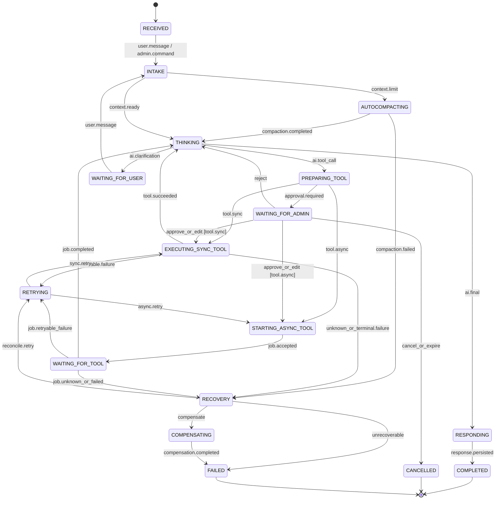

<!-- markdownlint-disable MD013 -->

# State Workflow Architecture

> **Scope:** an explicit, checkpointed agentic-chat workflow with User messages, hidden Admin-to-LLM instructions, Admin/HITL approvals, skills, synchronous tools, asynchronous tools, autocompaction, parallel branches, versioning, and durable recovery.

## 1. Executive assessment

A State Workflow separates adaptive AI decisions from deterministic orchestration. States and events define what may happen; nodes execute work; checkpoints or event history preserve progress.

```text
(state, event, guard) → next state + durable effects
```

This is the stronger choice when the product promise includes long waits, restart recovery, approvals, inspectable progress, explicit phases, parallel fan-out/fan-in, or migration of in-flight work. It typically requires more persistence, schema design, testing, and operational infrastructure than a Simple Loop.

Important distinction:

- a **graph checkpointer** saves graph state at boundaries;
- a **durable workflow runtime** also owns task dispatch, event history, replay, timers, signals, retries, and worker replacement.

These systems provide different checkpointing and durability features, as detailed in Section 8.

## 2. When this method fits

Choose State Workflow when one or more of the following are first-class requirements:

- execution must survive worker/process/deployment loss;
- Admin/User input may arrive minutes or days later;
- async jobs outlive HTTP requests;
- stages, branches, joins, retries, or compensation are explicit;
- completed expensive work should not be repeated;
- current state and history must be inspectable and auditable;
- workflow versions must coexist while old runs finish.

When infrastructure-loss recovery is required, use a durable workflow runtime rather than a graph checkpointer alone.

## 3. Normative statechart



The LLM may propose events and tool calls, but the workflow validates all transitions. Illegal transitions are rejected rather than corrected through prompting.

## 4. Workflow state and event contracts

### 4.1 State envelope

```text
WorkflowState
├── identity
│   ├── execution_id / workflow_id / run_id
│   ├── conversation_id
│   ├── workflow_definition_version
│   ├── state_schema_version
│   └── runtime_build_id
├── conversation
│   ├── visible_messages
│   ├── hidden_admin_commands
│   ├── compacted_context
│   └── compaction_boundary
├── control
│   ├── current_state / current_node
│   ├── pending_events
│   ├── cancellation_status
│   └── retry_budget
├── work
│   ├── selected_skill
│   ├── tool_operations
│   ├── async_jobs
│   └── outputs
├── authorization
│   ├── policy_version
│   ├── capabilities
│   └── pending_approvals
└── recovery
    ├── checkpoint_id / parent_checkpoint_id
    ├── event-history position
    ├── idempotency keys
    └── compensation plan
```

### 4.2 Events

Model channels as typed events, not undifferentiated text:

```text
UserMessage
AdminCommand
AIOutput
SkillSelected
ToolCallPrepared
ApprovalRequested
ApprovalResolved
SyncToolCompleted
AsyncJobAccepted
ExternalEventReceived
CompactionStarted
CompactionCompleted
RetryScheduled
CancellationRequested
RecoveryDecision
```

Every event has `event_id`, type/version, execution identity, causation/correlation IDs, actor, visibility, payload hash, idempotency key, and timestamp.

### 4.3 Transition definition

```text
Transition {
  from
  event
  guard
  target
  state_patch
  commands
  checkpoint_policy
  retry_policy
  compensation_policy
}
```

XState is a useful reference for legal state/event/guard contracts and model-based testing; it is not itself a complete durable agent runtime [XState Transitions][xstate-transitions] [XState Persistence][xstate-persistence].

## 5. Node and skill design

Create a separate node when its retry, timeout, authorization, side-effect, HITL, observability, checkpoint, or asynchronous behavior differs.

Recommended nodes:

```text
admit_input
authorize_admin_command
rebuild_context
autocompact_context
invoke_ai
prepare_tool_call
request_approval
execute_sync_tool
start_async_tool
wait_for_external_event
join_parallel_results
generate_response
persist_audit_event
recover_or_compensate
```

Model each skill as a subworkflow with input/output schemas, allowed tools, required capabilities, side-effect level, approval policy, timeout, retries, and compensation.

Do not put approval and a non-idempotent mutation in the same replayable node. LangGraph nodes restart from their beginning after an interrupt, so effects before `interrupt()` must be idempotent [LangGraph Interrupts][langgraph-interrupts].

## 6. HITL and hidden Admin control

### 6.1 Approval as a pending event

```text
approval_id
execution_id
checkpoint_id
workflow_definition_version
call_id
canonical_payload_hash
authorization_scope
expected_responder
created_at / expires_at
status
decision / approver
```

Resume only when the workflow is waiting on that exact approval, the payload and versions still match, authorization is valid, and the response has not expired or been consumed.

LangGraph resumes through a persisted interrupt and stable thread ID. Microsoft Agent Framework checkpoints pending typed requests and re-emits them after restoration. Temporal Updates provide validation and request/response semantics, while Signals need application-level deduplication [LangGraph Interrupts][langgraph-interrupts] [Microsoft HITL][ms-hitl] [Temporal Messages][temporal-messages].

### 6.2 Hidden Admin commands

Treat hidden Admin commands as signed control-plane events. Validate issuer, role, recipient, execution ID, conversation generation, policy version, context digest, sequence, expiry, nonce, and signature.

Apply them only at a safe node boundary. Queue commands received while AI or tools are in flight. They may alter model guidance but cannot bypass deterministic policy middleware or tool authorization. Never expose raw commands through User-visible messages, streams, summaries, or logs.

Prompt secrecy is not security; OWASP recommends deterministic privilege separation, least privilege, action-bound approval, and external authorization [OWASP Agent Security][owasp-agent].

## 7. Sync, async, parallel, and external work

### Synchronous tool

```text
prepared → approved → running → succeeded/failed/unknown
```

Persist the operation and idempotency key before execution. A timeout may mean the external side effect succeeded; reconcile before retry.

### Asynchronous tool

```text
start_async_tool
  → persist operation and callback correlation
  → submit job
  → WAITING_FOR_TOOL
  → external event or reconciliation scan
  → validate durable job status
  → transition to THINKING/RETRYING/RECOVERY
```

The workflow should park durably rather than hold a process or HTTP request open.

### Parallel work

Fan out only independent work. Use an explicit join that defines required branches, timeout, partial failure, conflict resolution, and compensation. LangGraph parallel nodes require reducers for shared state. Microsoft supersteps synchronize branches at barriers, so the slowest branch can delay aggregation [LangGraph Graph API][langgraph-graph] [Microsoft Workflows][ms-workflows].

## 8. Checkpointing versus durable execution

### Checkpoint-only option

Use a persistent graph checkpointer when requirements are primarily:

- conversation continuity;
- graph-state recovery;
- HITL interruption;
- time travel/debugging;
- application-managed task execution.

LangGraph checkpoints state at superstep boundaries and can preserve pending writes from successful parallel nodes [LangGraph Checkpointers][langgraph-checkpoints].

### Durable runtime option

Use Temporal, Dapr Workflow, Azure Durable Functions, Restate, DBOS, or equivalent when the runtime must own:

- durable task queues;
- activity dispatch/retries;
- timers and external events;
- worker replacement;
- replay after infrastructure failure;
- multi-day coordination.

| Runtime | Core recovery model | Main deployment implication |
| --- | --- | --- |
| Temporal | Event history + deterministic replay + Activities | Operate Temporal or use Temporal Cloud; formal worker versioning. |
| Dapr Workflow | Event-sourced replay + activities + actor reminders | Operate Dapr sidecars/runtime and state store. |
| Azure Durable Functions | Storage-backed orchestration history | Azure task hub/storage becomes part of guarantees. |
| Restate | Per-invocation journal of durable actions | Operate Restate server/cluster. |
| DBOS | Postgres checkpoints for deterministic steps | Postgres is system of record; high availability requires coordination. |

No runtime makes arbitrary external effects exactly once. Activities or steps can finish externally and crash before recording completion; use idempotency and reconciliation [Temporal Activities][temporal-activity] [DBOS Architecture][dbos].

## 9. Autocompaction

Autocompaction is an explicit resumable node:

```text
context.limit
  → AUTOCOMPACTING
  → persist versioned compacted context and source boundary
  → continue to THINKING
```

Invariants:

- pending calls, approvals, jobs, and control events remain outside lossy summaries;
- hidden Admin commands never enter User-visible summaries;
- compaction cannot change authorization or tool arguments;
- raw audit/event history remains recoverable;
- failures leave the previous committed context active;
- workflow definition and compaction schema versions are recorded.

## 10. Recovery, replay, and unknown outcomes

On resume:

1. load immutable checkpoint/event lineage;
2. validate state schema, workflow definition, runtime build, model, tool, and policy versions;
3. restore pending events and active operations;
4. reauthorize sensitive commands and approvals;
5. reuse completed node/activity results;
6. reconcile `running` or `unknown` external operations;
7. resume at the exact graph boundary;
8. reject concurrent duplicate resumes through optimistic concurrency.

Resumption commonly uses replay rather than instruction-pointer continuation. LangGraph re-runs interrupted nodes; Temporal/Dapr/Azure replay orchestration code; ADK may rerun incomplete tools. Side effects therefore belong in idempotent activity/task boundaries.

## 11. Versioning and migration

Persist three independent versions:

```text
state_schema_version
workflow_definition_version
runtime_build_id
```

Resume policy:

```text
same schema + compatible workflow → resume
declared migration             → migrate then resume
unknown/incompatible version   → STALE_VERSION and operator action
```

Temporal provides worker versioning and pinned/auto-upgrade behavior. Microsoft requires stable topology and executor IDs for checkpoint rehydration. OpenAI recommends storing agent/SDK versions with pending states. Google ADK warns that stopped workflows should not be modified before resume [Temporal Versioning][temporal-versioning] [Microsoft Checkpoints][ms-checkpoints] [OpenAI HITL][openai-hitl] [ADK Resume][adk-resume].

Never silently reuse an approval after tool schema, arguments, policy scope, workflow semantics, or checkpoint lineage changes.

## 12. Operations and cost

### Operational advantages

- inspectable current state and legal transitions;
- structured traces and per-node metrics;
- durable waits and, with a durable workflow runtime, worker replacement;
- localized retries and partial replay;
- natural handling for approvals and external events;
- deterministic test modes in several frameworks.

### Operational costs

- checkpoint/event writes at every selected boundary;
- storage growth and retention management;
- replay-compatible code and workflow versioning;
- serialization restrictions;
- task queue/runtime infrastructure;
- vendor/runtime coupling;
- higher coordination latency;
- more complex local development and migration testing.

Benchmark checkpoint bytes per run, writes per run, p95 checkpoint-write and checkpoint-read latency, resume latency, history growth, trace volume, worker-churn recovery, and storage cleanup. First-party documentation defines semantics but not your workload’s performance envelope.

## 13. Required tests

- every legal and illegal transition;
- unauthorized Admin event and replayed command;
- crash before/after each checkpoint and side effect;
- node replay after interruption;
- pending approval restoration and stale approval rejection;
- duplicate external event and concurrent resume;
- parallel partial failure and join timeout;
- unknown side-effect reconciliation;
- compaction with pending calls/approval/jobs;
- workflow migration from prior state schemas/builds;
- worker fleet restart and backlog drain;
- retention and checkpoint pruning without breaking live runs.

## 14. Framework selection guidance

| Need | Strong candidate |
| --- | --- |
| Agent graph, HITL, checkpoints, Python/JS | LangGraph |
| Agent-native graph/runtime/evaluation | Google ADK |
| Typed executors, request ports, enterprise workflow | Microsoft Agent Framework |
| Formal statecharts and model-based testing | XState as contract layer |
| Durable multi-day orchestration | Temporal |
| Dapr-based platform integration | Dapr Workflow |
| Azure serverless ecosystem | Durable Functions |
| Journaled durable service calls | Restate |
| Postgres-centered durable steps | DBOS |

## 15. Primary references

1. [LangGraph Graph API][langgraph-graph]
2. [LangGraph Checkpointers][langgraph-checkpoints]
3. [LangGraph Interrupts][langgraph-interrupts]
4. [LangGraph Persistence][langgraph-persistence]
5. [Temporal Architecture][temporal-architecture]
6. [Temporal Workflow Definition][temporal-workflow]
7. [Temporal Activities][temporal-activity]
8. [Temporal Worker Versioning][temporal-versioning]
9. [Dapr Workflow][dapr-workflow]
10. [Azure Durable Orchestrations][azure-durable]
11. [Restate Concepts][restate]
12. [DBOS Architecture][dbos]
13. [Microsoft Workflows][ms-workflows]
14. [Microsoft Checkpoints][ms-checkpoints]
15. [Microsoft HITL][ms-hitl]
16. [Google ADK Graphs][adk-graphs]
17. [Google ADK Resume][adk-resume]
18. [XState Transitions][xstate-transitions]
19. [XState Persistence][xstate-persistence]
20. [OWASP AI Agent Security][owasp-agent]

[langgraph-graph]: https://docs.langchain.com/oss/python/langgraph/graph-api
[langgraph-checkpoints]: https://docs.langchain.com/oss/python/langgraph/checkpointers
[langgraph-interrupts]: https://docs.langchain.com/oss/python/langgraph/interrupts
[langgraph-persistence]: https://docs.langchain.com/oss/python/langgraph/persistence
[temporal-architecture]: https://docs.temporal.io/encyclopedia/architecture/temporal-architecture
[temporal-workflow]: https://docs.temporal.io/workflow-definition
[temporal-activity]: https://docs.temporal.io/activity-definition
[temporal-messages]: https://docs.temporal.io/handling-messages
[temporal-versioning]: https://docs.temporal.io/worker-versioning
[dapr-workflow]: https://docs.dapr.io/developing-applications/building-blocks/workflow/workflow-overview/
[azure-durable]: https://learn.microsoft.com/en-us/azure/durable-task/common/durable-task-orchestrations
[restate]: https://docs.restate.dev/foundations/key-concepts
[dbos]: https://docs.dbos.dev/
[ms-workflows]: https://learn.microsoft.com/en-us/agent-framework/workflows/workflows
[ms-checkpoints]: https://learn.microsoft.com/en-us/agent-framework/workflows/checkpoints
[ms-hitl]: https://learn.microsoft.com/en-us/agent-framework/workflows/human-in-the-loop
[adk-graphs]: https://adk.dev/graphs/
[adk-resume]: https://adk.dev/runtime/resume/
[xstate-transitions]: https://stately.ai/docs/transitions
[xstate-persistence]: https://stately.ai/docs/persistence
[openai-hitl]: https://openai.github.io/openai-agents-python/human_in_the_loop/
[owasp-agent]: https://cheatsheetseries.owasp.org/cheatsheets/AI_Agent_Security_Cheat_Sheet.html
